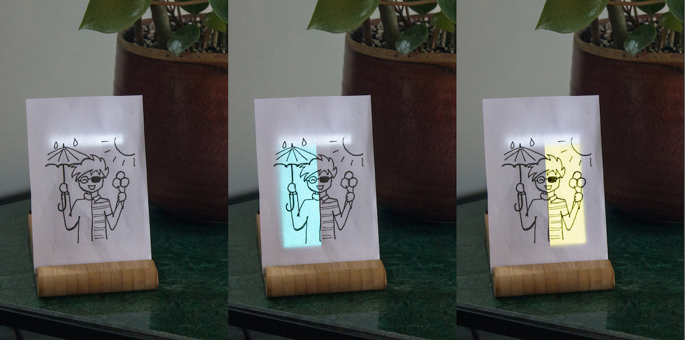

# **Turn an Unused Smartphone Into a Smart Display**

Do you have an (old) unused smartphone? Turn it into a smart display using Google Sheets and some pen and paper, by following this easy step-by-step tutorial.

When you finished the tutorial, you will have turned your phone into 'smart display'. The screen of your phone will then change colour based on some data that you choose. For example, the screen could turn _turn blue on the left when it will rain_, and _turn yellow on the right when the temperature is high_ (see also the picture at the top). Now, when you add a little drawing in front of your phone it shows you, and anyone else at home, what the colours mean.

Since your choice of data and your creativity with drawing allows for countless possibilities, we just can't imagine what you will use your smart display for!

[Check the video](#video){: .btn .btn-blue target="_blank"}

<!-- TODO: get some help, go creative with drawing! ?? Perhaps seperate taasks?-->

## Supplies
<!-- TODO: something about parents for account, do it together! -->
- A smartphone that can connect to your Wi-Fi (_preferably one you don't need for a while_)
- Some pen and paper
- A computer/laptop to set things up
- A [Google account](https://myaccount.google.com/){:target="_blank"} (_for using Google Sheets_)
- An [IFTTT.com](https://www.ifttt.com/){:target="_blank"} account (_for connecting it to data_)

_If you are using an older smartphone, consider resetting it to factory settings (though will delete everything on the phone!). Either way, it is always good practice to update the software and security updates to the latest version (as far as it goes). We wrote a bit more info about the safety of older phones [here](https://www.phonegrown.site/#more-phones){: target="_blank"}._

## Step 1: the Google Sheet
Normally, Google Sheets is mainly used for storing numbers in large tables - but because it is online and very flexible, you can do quite interesting things with it. For this tutorial we will use it as the  'brain' of your smart display. We have prepared a Sheet for you with everything you need - which works almost like an app. With it, you can create the colourful backgrounds for your phone and easily set up rules depending on the data you'd like (for example, 'turn blue when it rains'). We need to copy this Sheet using the link below and prepare it in two quick steps.

On a laptop/computer go, copy the [the Google Sheet from here](#copy){: target="_blank"}. _This will probably ask you to log in to a Google Account._

### 'Publish' your Google Sheet
The following steps will connect the Sheet to the internet, which helps you to connect your phone in the next section. We only have to click a few buttons, but it might look somewhat messy. This is because we basically are turning your Sheet into a little app. Most likely you have never done this before, and that is why Google will show you a warning at some point. If you copied the Google Sheet from the link above - it is safe to continue. However, if you want to know precisely what your app will do, we explain it in more detail on our website [here](https://www.phonegrown.site/#more-tech). At any point in time, you can always undo the 'publishing' of your app by following [these steps](https://www.phonegrown.site/#more-undo)

Once you have the Google Sheet in front of you:
1. press the purple _Setup_ button.
1. go to _Tools > Script Editor_ in the Google Sheet menu bar. This opens a new tab.
1. click on _Publish > Deploy as web app_ in the menu bar on that tab.
1. click _Update_, and _Review Permissions_ when it asks for authorisation in the popups that follow. You might need to log in with your Google Account.
1. click _Advanced_ (in the bottom left) and then, at the bottom, click on _Go to phonegrown_v3 (unsafe)_. By clicking on _Allow_ allow (or authorise) your google Sheet to connect to other services on the internet (including your phone in the next step).
1. _copy the long URL_ link shown in the popup, and
1. paste this next to the _PASTE APP LINK_ on the _Home_ screen of your Google Sheet.

That's all set! You can now close the extra tab, but keep the Google Sheet tab handy.  

## Step 2: the Phone
Once you found an unused phone for this project (_don't worry about cracked screens_), we need to change some of its settings and connect it to your Google Sheet.

### Adjust phone settings
Normally, phones dim their screen in dark spaces or when you don't use it for a minute or so. But, to make it into a smart display we need to make sure its screen always stays on. This won't consume much energy, but we wrote more details about that [here](https://www.phonegrown.site/#more-sust){:target="_blank"}. Adjusting your phone's settings can be different per phone, but will most likely be something like this:

1. For **Android** phones, enable the _developer_ mode by tapping 7 times on the _build number_ in _Settings > About Phone_. Then in _Settings > System > Developer Options_ turn on _Stay Awake (when charging)_. For **Apple** devices, we can set the _Auto-Lock_ to _Never_, which you can find in _Settings > Display & Brightness_. Here are more details and pictures on how to do this for [Android](https://www.howto-connect.com/how-to-stay-awake-phone-screen-while-charging-on-android/){:target="_blank"} or [iOS](https://forums.tomsguide.com/faq/how-to-change-the-auto-lock-time-in-ios-11.19693/){:target="_blank"}.
1. Where possible, also disable the _Adaptive brightness_ (or Auto-Brightness) of your phone. We want to make sure the screen is visible through the paper. For **Android**, you can most likely change this in _Settings > Display_, and for **Apple** devices this is often in _Settings > Accessibility > Display & Text Size_.
1. Don't forget to set the screen brightness to 100% and, of course, plug in a charger!

### Connect it to the Google Sheet
On the phone, go to [www.phonegrown.site/phone](http://www.phonegrown.site/phone){:target="_blank"}. Enter your _Phone Grown ID_ which you can find in the top of your Google Sheet at the 'Home' tab.

That's it! Now, in Google Sheets, go to the _'[BG] 1'_ tab, and click on _test_ in the top left. Did your phone's screen change colour?

## Step 3: the Data
There are various ways in which we could let your phone respond to different types of data, but in this tutorial we will be using a website called [IFTTT](http://www.ifttt.com){:target="_blank"}, or "If This, Then That". This website allows us to create connections with different types of data, which they call _Applets_. Lucky for us, they support Google Sheets! If you don't have an IFTTT account yet, now would be a good time. You can sign up at [ifttt.com/join](https://ifttt.com/join){: target="_blank"}.

### Create an 'Applet'
On IFTTT.com we can create 'applets'. These are

###
- need to set up one (or multiple) _Applets_ to send data to Google Sheets. luckily this is one of the options already.
There are quite some tutorials out there that go into depth, such as [this one](https://business.tutsplus.com/tutorials/how-to-use-ifttt-with-google-sheets--cms-28355)

, such as the weather or RSS feeds. Setting up any IFTTT 'applet' consists of two steps. Step 1 is setting up a 'trigger' of your choice. In our case, **Step 2 will be the same for any trigger you choose** - as we will be using IFTTT's provided Google Sheet integration to connect to our Google Sheet.

> If you follow this approach, you will need (to create) an IFTTT.com account. Some services require you to log in (often with your Google Account), and require access to some of your information. Read more on [IFTTT's privacy policy](https://ifttt.com/terms) and [Google's advice on third party access](https://support.google.com/accounts/answer/3466521).  

- What's the name? If you haven't changed it (top left), then it will be something like 'Copy of Phone Grown'
- check where it is stored on your google drive.  (Menu > File > Document Details). If it says 'My Drive', your location will be <your name>, else it will be Folder Name/Sheet Name

## Step 4: the Drawing

## Step 5: All good! Now experiment

functionalities:
- coloured areas overlap! E.g. (pictures)
- can set times to make the screen turn black (for example at night) (but we leave the phone on at all times)
- green dot slowly blinking to show it is running (will show red if issues)
